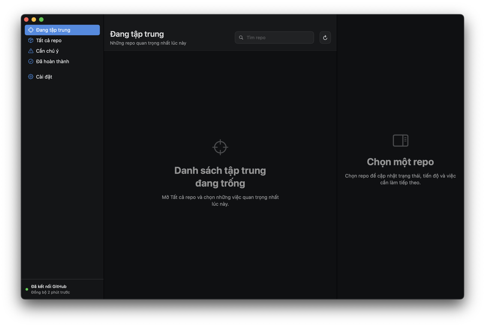

# RepoFocus

RepoFocus is a local-first macOS app for deciding which GitHub and GitLab repositories matter now, recording progress, and keeping one clear next action for each repository or branch.



## Current MVP

- Native three-column macOS interface built with SwiftUI
- Focus, Daily Activity, All Repositories, Needs Attention, Completed and Settings views
- Daily GitHub and GitLab activity totals for pushes, commits, branches and repositories
- Pushes grouped by repository and branch, with commit subjects categorized as features, fixes, refactors, documentation, tests, build or maintenance work
- A daily macOS reminder listing the focused repositories and branches that need attention
- An in-app "Needs attention today" panel prioritized by deadlines, blockers and merge conflicts
- Personal status, priority, progress, next action, deadline and notes
- Focus projects can use either manual percentage progress or a task outline
- Outline tasks can be checked manually or completed automatically by matching a new local commit title
- Focus status, progress, deadlines and outlines are isolated per Git branch
- Clone a repository from a connected GitHub/GitLab account or any HTTPS/SSH Git remote URL, with live phase and overall percentage progress
- Local JSON persistence in Application Support
- Reuses signed-in GitHub CLI and GitLab CLI sessions without storing duplicate tokens
- Paginated GitHub GraphQL and GitLab REST sync
- Local Git checks for uncommitted files, commits waiting to push, commits waiting to pull and merge conflicts
- A local Git workspace for switching branches, committing all changes, fast-forward pulling, pushing and merging branches
- Open a new Codex task with the selected local repository already set as its workspace
- Safe commit recovery through `git revert`, which creates a new commit instead of rewriting published history
- Guided merge/revert conflict resolution: keep the current or incoming version, open a file for manual editing, mark it resolved, then continue or abort
- Automatic local checkout detection by matching GitHub/GitLab `origin` remotes, including nested GitLab groups
- Offline cache and sample workspace
- Light Mode plus a neutral charcoal Dark Mode, with keyboard-friendly custom controls
- Custom app icon and in-app theme/language preferences
- Vietnamese interface written for project-management context, with English available

The app reads repository metadata and activity from connected GitHub and GitLab accounts. Personal tracking fields remain on this Mac.

## Review daily activity

1. Open **Activity** in the sidebar and choose a date.
2. Review the push, commit, branch and repository totals for that day.
3. Open each repository/branch group to see when each push happened and which commit subjects describe the change.

RepoFocus combines the signed-in user's GitHub and GitLab push events, then compares revision ranges when available to recover commit totals and messages. The latest 31 daily snapshots are cached locally. Provider event delivery can be delayed, so the refresh time is always shown in the interface.

## Daily reminders

1. Open **Settings** and enable **Remind me every day**.
2. Adjust the reminder time in 30-minute steps with the custom time control.
3. Choose **Send test** to verify the macOS notification permission and appearance.

The reminder includes focused repository names, current branches, next actions and urgent reasons such as an overdue deadline, a deadline today, a blocker or a merge conflict. Clicking the notification returns to the Focus view. RepoFocus also shows the same prioritized list at the top of the Focus dashboard and places its count on the Dock icon.

## Work with local Git

1. RepoFocus automatically searches common development folders after a GitHub or GitLab sync.
2. Select a repository and use **Find on this Mac** to scan again when needed.
3. Paste a path manually only when the checkout is stored somewhere unusual.
4. Choose **Check Git** to refresh its current state.
5. Use the Git workspace to switch branches, commit, pull, push, merge or inspect commit history.
6. Choose **Revert** beside a commit to create a safe undo commit without rewriting history.

Every action runs against the exact linked folder and refreshes the repository state afterwards. Commit explicitly stages the whole working tree with `git add -A`; pull uses `--ff-only` so it never creates an unexpected merge; push establishes the current branch's upstream when needed. If merge or revert produces conflicts, RepoFocus lists every affected file and lets the user keep either side, open the file in its default editor, mark a manual edit resolved, continue, or abort. RepoFocus never uses `reset --hard`.

## Clone a repository

1. Choose **Clone** in the content header.
2. Select a repository from a connected GitHub/GitLab account, or switch to **Use Git URL**.
3. Choose the parent folder on this Mac and confirm the final path.
4. RepoFocus runs `git clone`, links the new checkout, reads its branches and checks local Git status.

Repositories cloned from external URLs remain in the local workspace after account refreshes.

## Run from source

This Mac currently has Swift Command Line Tools but does not have an active full Xcode installation. The app therefore ships as a Swift Package that can be built immediately:

```sh
cd /Users/toiladem/Documents/Codex/2026-07-21/t/outputs/RepoFocus
swift run RepoFocus
```

To build a double-clickable local app bundle:

```sh
cd /Users/toiladem/Documents/Codex/2026-07-21/t/outputs/RepoFocus
./Scripts/package_app.sh
open dist/RepoFocus.app
```

The bundle is ad-hoc signed for local use. It is not notarized for distribution to other Macs.

## Connect GitHub

1. Sign in once with `gh auth login` in Terminal.
2. Open **Settings** in RepoFocus.
3. Choose **Connect current account**.

RepoFocus asks GitHub CLI for the active session when it syncs. It does not write a duplicate token to Keychain, the repository database or logs.

## Connect GitLab

1. Install GitLab CLI and sign in once with `glab auth login` in Terminal.
2. Open **Settings** in RepoFocus.
3. Choose **Connect current account** in the GitLab card.

RepoFocus calls `glab api` through the active CLI session and never reads or stores a duplicate token. Cloning a public or otherwise Git-authenticated GitLab URL works even when account sync is not connected.

## Local data

Tracking data and the latest provider caches are stored at:

```text
~/Library/Application Support/RepoFocus/repositories.json
```

## Verification

```sh
swift build
swift test
```

## Project structure

```text
Sources/RepoFocusCore   Models, persistence, GitHub/GitLab clients and local Git operations
Sources/RepoFocus       SwiftUI application and views
Tests                   Core behavior and persistence tests
Scripts                 Local .app packaging
Resources               Bundle metadata
```
